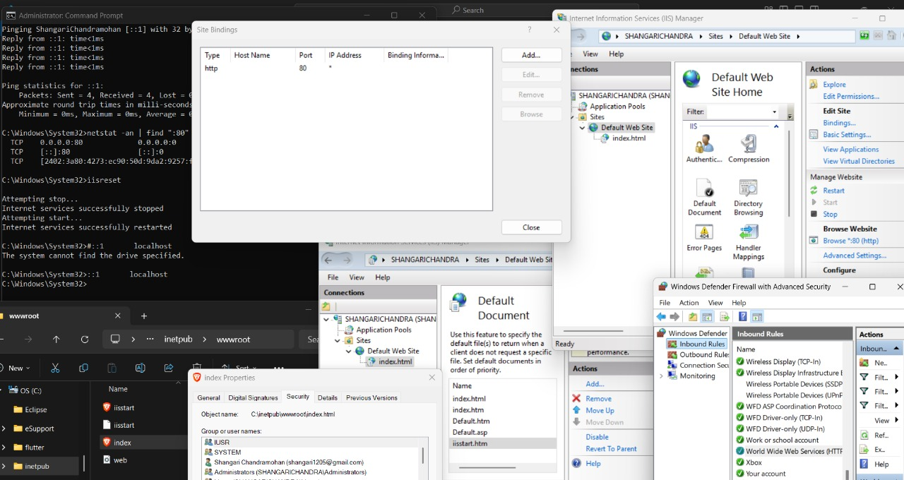
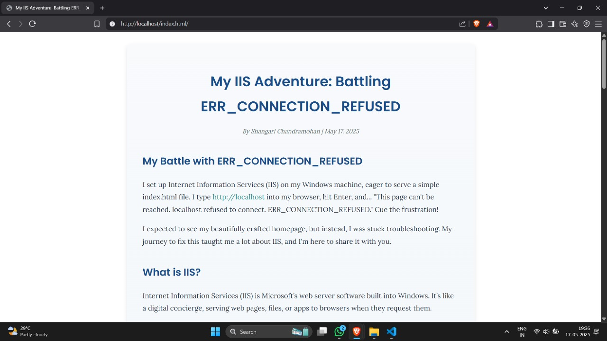

# IIS-Troubleshooting
A practical log of troubleshooting and configuring IIS to serve web pages efficiently. Covers common errors faced, step-by-step fixes, and lessons learned to help others quickly resolve IIS setup issues and optimize their web server environment.

*This is my journey*

*THE BLOG*

